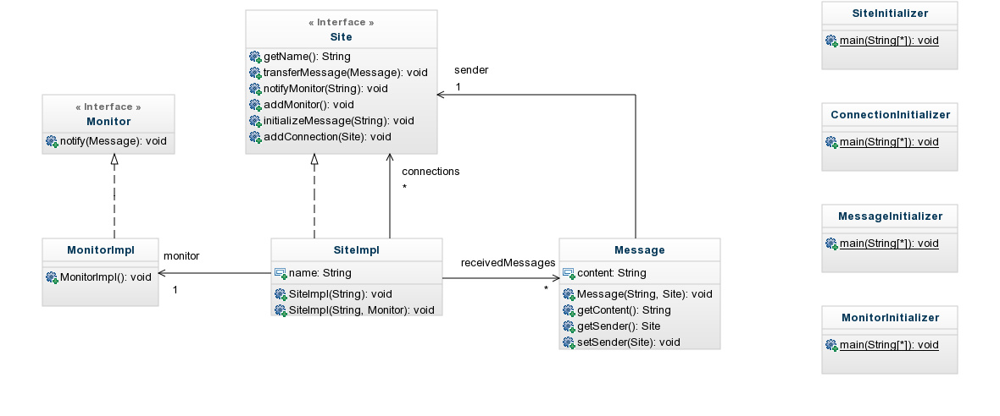

#### RMI Java - Romain SOMMERARD - 29/03/15


# Introduction

Ce projet permet de manipuler des objets distribués par le biais de RMI.

RMI permet de partager des ressources (objets) entre plusieurs machines virtuelles.


# Architecture

## Diagramme UML



## Scripts

| Nom | Description |
|-----|-------------|
| arbre_1.sh | Simule un arbre à 6 noeuds. Le message est initialisé par le noeud 1 (racine). |
| arbre_2.sh | Idem excepté que le message est initialisé par le noeud 2. |
| graph_1.sh | Simule un graph à 6 noeuds. Le message est initialisé par le noeud 1 (racine). |
| graph_4.sh | Idem excepté que le message est initialisé par le noeud 4. |
| graph_1_6.sh | Idem excepté que le message est initialisé par les noeuds 1 et 6. |
| clean_process.sh | Supprime les processus. |

## Packages
| Nom | Description |
|-----|-------------|
| initializer | Ce package contient les classes d'initialisation des objets RMI. |
| rmi | Ce package contient les classes et interfaces RMI. |
| test | Ce package contient les tests unitaires du projet. |


# Code sample

- Ressource synchronisé lors de la réception de plusieurs messages en même temps sur le même noeud.

```java
// SiteImpl.java
@Override
public void transferMessage(final Message message) throws RemoteException {
  this.notifyMonitor("Message received from site " + message.getSender().getName() + ": " + message.getContent());

  synchronized(this.receivedMessages) {
    if(this.receivedMessages.contains(message)) {
      return;
      }

    this.receivedMessages.add(message);
  }

  ...

}
```

- Envoie concurent aux noeuds connectés (au passage, on ne renvoie pas au noeud qui vient de nous envoyer le message).

```java
// SiteImpl.java
@Override
public void transferMessage(final Message message) throws RemoteException {

  ...

  for(final Site site : this.connections) {
    if(site.equals(sender)) {
      continue;
    }

    new Thread(new Runnable() {
      @Override
        public void run() {
        try {
          site.transferMessage(message);
        } catch (RemoteException e) {
          e.printStackTrace();
        }
      }
    }).start();
  }
}
```

- Surcharge de la méthode "equals" pour le test d'égalité des messages (avec la méthode "hashCode" pour que celle-ci renvoit toujours la même valeur).

```java
// Message.java
@Override
public int hashCode() {
  return 1;
}

@Override
public boolean equals(Object obj){
  if(obj instanceof Message){
    Message message = (Message) obj;

  if(this.getContent().equals(message.getContent())) {
        return true;
    }
  }

  return false;
}
```
